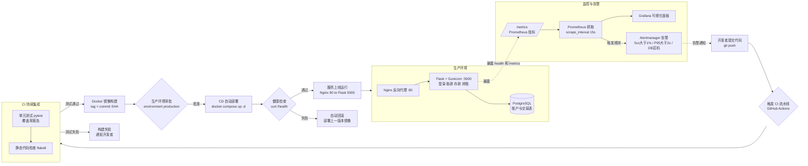
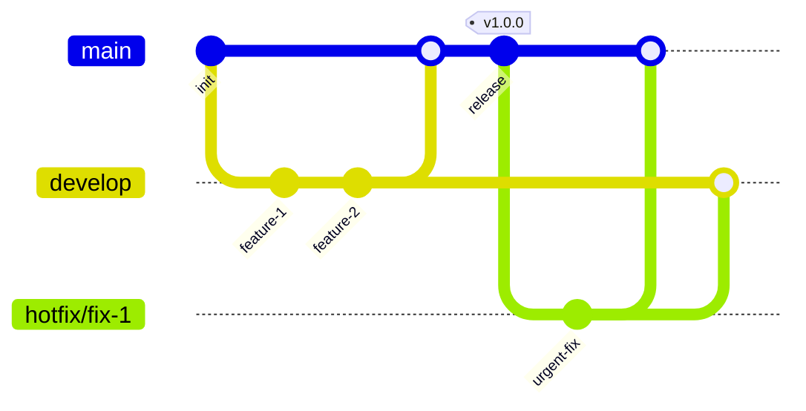

# DevOps 报告

## 一、端到端架构流程图（代码提交 → 生产部署 → 监控告警）

## 二、分支策略与环境

## 三、说明

本仓库提供 CI/CD 定义；实际运行截图需在将仓库推送到 GitHub/Gitee、配置 Secrets 与部署主机后取得，不能由本地源代码替代。

- **CI 流水线**：Gitee Go（`.workflow/ci-cd.yml`）与 GitHub Actions（`.github/workflows/ci-cd.yml`）双平台配置
- **CD 部署**：Docker Compose 编排 PostgreSQL + Flask + Nginx + Prometheus + Grafana
- **监控**：`/health` 健康检查 + `/metrics` Prometheus 指标 + Grafana 面板 + 告警规则
- **回滚**：基于 Docker 镜像版本标签的快速回滚机制，部署失败自动回滚到上一稳定版本
